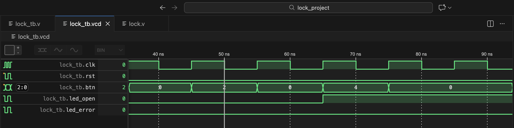

# 🔒 Electronic Code Lock (FSM on Verilog)
My digital design project: a 3-digit electronic combination lock implemented using a Finite State Machine (FSM) on Verilog HDL.

## 📌 Project Overview
The system models an electronic lock with a reset button and an input vector for digits. 
* Target combination: 1 -> 3 -> 2
* Success condition: led_open turns HIGH (`1`)
* Error condition: Any wrong input sequence turns led_error HIGH (`1`)
The FSM is designed using the two-always-block style (separated state transition logic and sequential state memory) to ensure clean, glitch-free, and synthesis-friendly hardware generation.


## ⚙️ Hardware Architecture & FSM States
The module defines 5 distinct states:
* STATE_IDLE (3'b000) — Waiting for input, lock is closed.
* STATE_NUM1 (3'b001) — Digit '1' entered successfully.
* STATE_NUM3 (3'b010) — Digit '3' entered successfully.
* STATE_OPEN (3'b011) — Lock is successfully opened (`led_open = 1`).
* STATE_ERROR (3'b100) — Wrong sequence entered (`led_error = 1`).

### Button Mapping inside Testbench
Since the buttons are mapped as a 3-bit vector btn[2:0], the sequential execution translates to the following decimal values during simulation:
1. Digit 1 active (`btn[0]`) $\rightarrow$ Simulation value: 1
2. Digit 3 active (`btn[1]`) $\rightarrow$ Simulation value: 2
3. Digit 2 active (`btn[2]`) $\rightarrow$ Simulation value: 4

## 📊Waveform Result



## 💻 Simulation & Verification
The project was simulated using Icarus Verilog and verified via wave tracing inside VS Code.

### How to run simulation:
```bash
# Compile the design and testbench
iverilog -o lock_sim.out lock.v lock_tb.v

# Run simulation to generate VCD file
vvp lock_sim.out